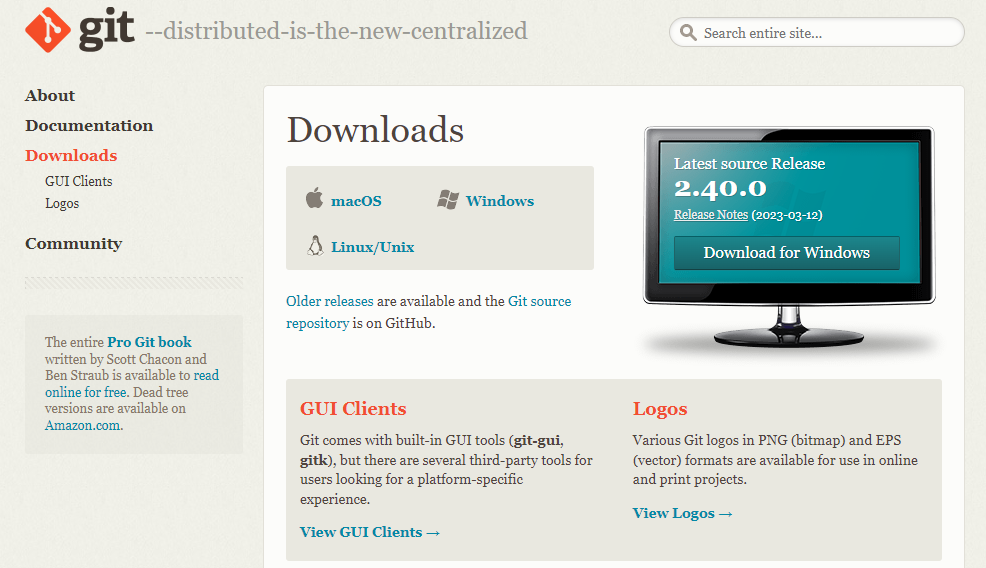
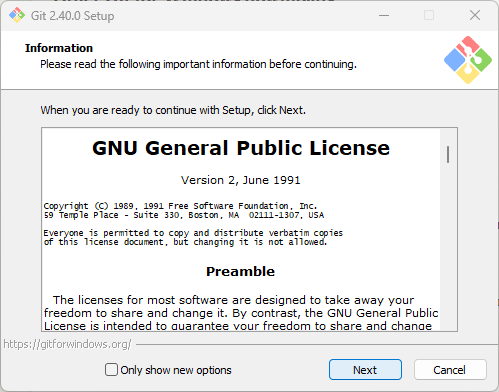
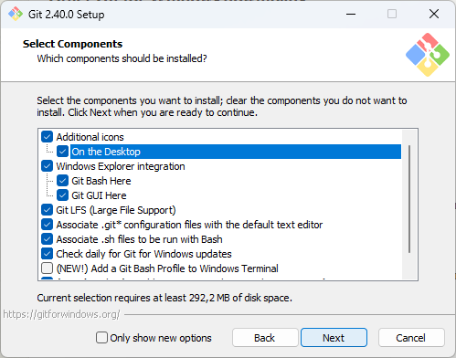
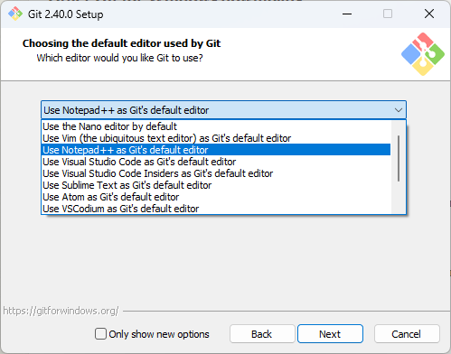
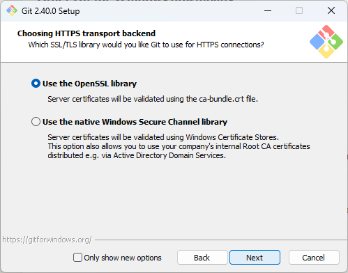
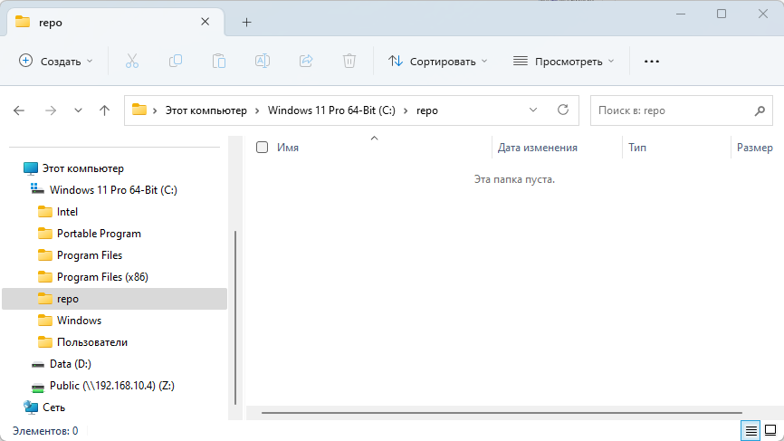
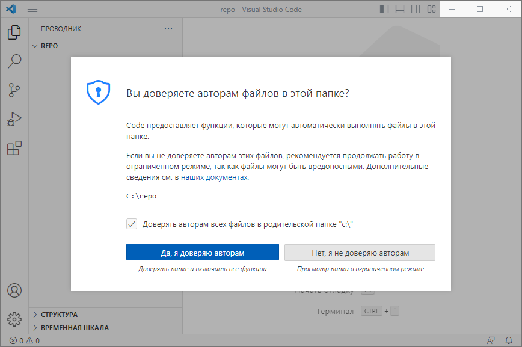
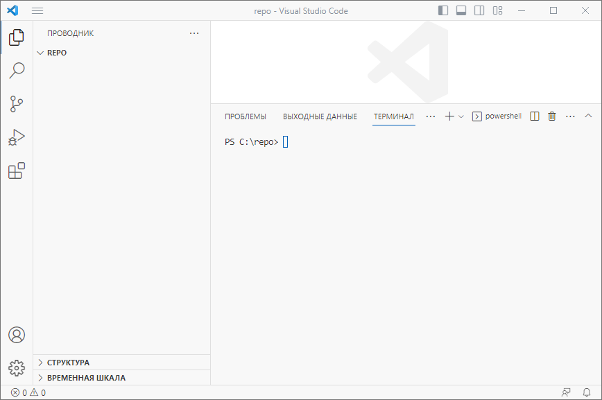

# <center>**Инструкция по Git**
## 1. Установка и настройка Git
### Установка Git
* Заходим на официальный сайт **Git** (https://git-scm.com/downloads)
* Выбираем свою операционную систему с учетом разрядности и скачиваем файл установки. В нашем случае это будет **Windows x64**


* Запускаем файл установки **Git** и нажимаем **Next**


* Отмечаем (опционально) галочкой **On the Desktop**, что добвит нам ярлык на рабочий стол и снова нажимаем **Next**


* Выбираем лубой удобный для Вас редактор и снова нажимаем **Next**



* Далее жмем **Next** оставляя все опции по умолчанию пока не начнется установка **Git** 


* После установки жмем **Finish**

### Настройка Git
* Запускаем **терминал** или кликаем по ярлыку **Git Bash** на рабочем столе проверяем установку **Git** командой:
```
git --version
```
* При правильной установке получаем ответ (цифры версий могут отличаться):
```
git version 2.40.0.windows.1
```
* Далее нам нужно задать *имя* и *электронную почту*, которыми будут подписываться наши коммиты:
```
git config --global user.name "Ваше имя"
git config --global user.email "Ваша электронная почта"
```
### На этом установка и настройка Git закочены
<br>

## 2. Инициализация репозитория
* На компьютере, желательно в корне диска, создаем новую папку **"repo"**: 


* Переходим в нее в терминале: 
```
cd c:\repo
```

* Либо если используем **Visual Studio Code** - *Файл - Открыть папку...* и указываем на созданную нами папку **repo** и соглашаемся с доверительными условиями:



и открываем встроенный в программу терминал нажатием на *Ctrl + ~*



* Для инициализации репозитория набираем команду:
```
git init
```
получаем ответ 
```
Initialized empty Git repository in C:/repo/.git/
```
* Проверяем командой:
```
ls -h
```
получем ответ
```
Каталог: C:\repo


Mode                 LastWriteTime         Length Name
----                 -------------         ------ ----
d--h--        06.04.2023     18:42                .git
```
видим что появилась скрытая папка **.git** и тем самым прверяем что инициализация репозитория прошла успешно!
<br>

## 3. Запись изменений в репозиторий
* Для начала проверим статус репозитория командой:
```
git status
```
получаем ответ 
```
On branch master

No commits yet

nothing to commit (create/copy files and use "git add" to track)
```
это означает что мы находимся в ветке **master**, у нас нет коммитов и нам нечего коммитить, так нет никаких файлов
* Создадим файл READMI.md командой: 
```
echo 'Домашняя работа' > READMI.md
```


### Домашнее задание
* Установка и настройка Git
* Инициализация репозитория
* Запись изменений в репозиторий
* Получение информации по истории коммитов
* Сравнение с последним коммито
* Перемещение между сохранениями
